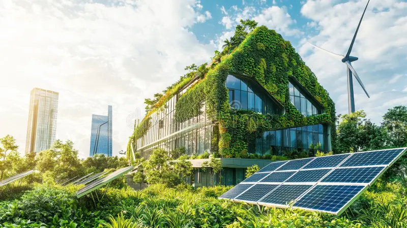
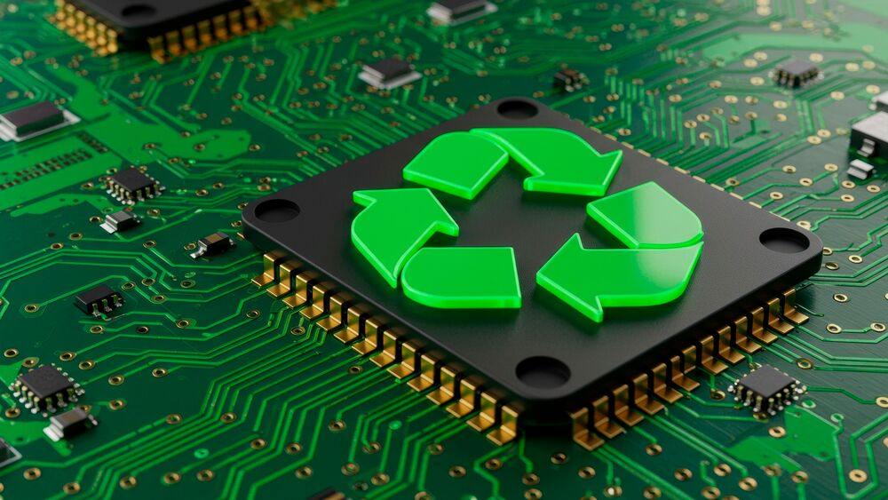

# TechSustent-vel

## Estrutura dos códigos

### 1. Para listas 
```
<div class="SessaoOqueExibe">
            <div class="Titulo">
                <h2>O que será mostrado?</h2>
            </div>

            <ul>
                <li><b>Guia de Descarte Correto:</b> Aprenda onde e como reciclar seus aparelhos eletrônicos antigos sem
                    agredir a natureza.</li>

                <li><b>Tecnologias Verdes (Green Tech):</b> Conheça as inovações, gadgets e empresas que estão liderando a
                    transição para um ecossistema digital sustentável.</li>

                <li><b>Hábitos Digitais Conscientes:</b> Dicas simples para o seu dia a dia, como reduzir o consumo de energia
                    dos seus aparelhos e limpar seu lixo digital.</li>
            </ul>
        </div>
```
# CSS
```
.SessaoOqueExibe{
   width: 100%;
   display: flex;
   flex-direction: column;
   justify-content: flex-start;
   padding: 30px;
   gap: 20px;
}

.Titulo h2{
    color: var(--cor-titulos);
}

.SessaoOqueExibe ul{
    margin-left: 30px;
    text-decoration: none;
    color: var(--cor-textos);
}
```
### 2. Para titulo, paragrafo e imagens embaixo
``` 
<div class="sessaoBoasVindas">
            <div class="cabecalho">
                <h1>Bem vindo ao site!</h1>
                <p>Aqui, nós exploramos como a inovação e o respeito ao meio ambiente podem caminhar juntos. Descubra
                    como escolhas tecnológicas conscientes desde o descarte correto de lixo eletrônico até o uso de
                    softwares ecoeficientes podem reduzir nossa pegada de carbono e transformar o futuro do planeta.
                    Conecte-se com ideias, práticas e soluções para uma tecnologia mais verde e responsável.</p>
            </div>

            <div class="containerImagens">
                
                
                
            </div>
        </div>
```
# CSS

```
.sessaoBoasVindas{
   width: 100%;
   gap: 50px;
   display: flex;
   flex-direction: column;
   justify-content: center;
   align-items: center;
   padding: 50px;
   min-height: 100px;
}
.cabecalho{
    width: 100%;
    padding: 5px;
    display: flex;
    flex-direction: column;
    justify-content: center;
    align-items: center;
    text-align: center;
    gap: 20px;
}

.cabecalho h1{
    color: var(--cor-titulos);
}

.cabecalho p{
    line-height: 1.5;
}

.containerImagens{
    width: 76%;
    min-height: 300px;
    padding: 20px;
    display: flex;
    gap: 50px;
    background-color: rgba(0, 0, 0, 0.651);
    justify-content: center;
    align-items: center;
    border-radius: 10px;
}

.containerImagens img{
    width: 30%;
    object-fit: cover;
    height: auto;
    border-radius: 7px;
    transition: 0.5s;
}

.containerImagens img:hover{
    transform: scale(1.1);

}
```
## Apenas titulo e parágrafo

```
<div class="SessaoInformacoes">
            <h1>Tecnologias e como elas podem ser sustentáveis</h1>
            <p></p>
            /*Pode colocar inumeros títulos e parágrafos que já organiza sozinho, isso vale para todos */
        </div>
```
# CSS

```
.SessaoInformacoes{
    width: 100%;
    padding: 30px;
    text-align: left;
    display: flex;
    flex-direction: column;
    justify-content: flex-start;
    gap: 50px;
}
.SessaoInformacoes h1, h2, h3{
    color: var(--cor-titulos);
}

.SessaoInformacoes p{
    color: var(--cor-textos);
    line-height: 1.5;
}
```
